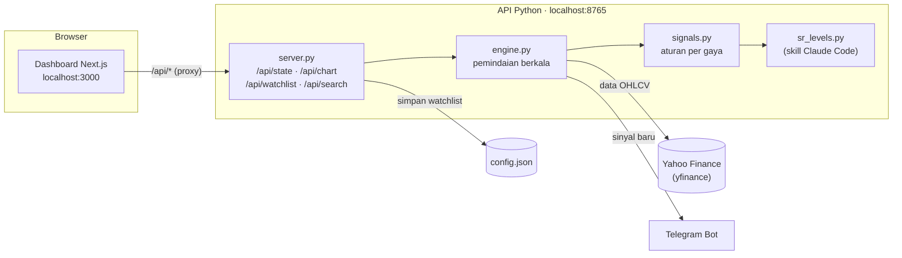

# A-Stocks — Pemindai Sinyal Saham IDX

Aplikasi lokal untuk memindai saham **Bursa Efek Indonesia (BEI/IDX)** di watchlist kamu. Aplikasi menampilkan **sinyal teknikal dan rencana skenario** (entry, stop loss, target, R:R setelah biaya) di dashboard web dengan **chart candlestick**, dan bisa mengirim notifikasi ke **Telegram**.

Perhitungannya memakai skill Claude Code [`idx-support-resistance`](.claude/skills/idx-support-resistance/SKILL.md): zona support/resistance, pola candlestick, RSI, MACD, moving average, volume, Fibonacci, serta aturan BEI (fraksi harga, ARA/ARB, lot).

> [!WARNING]
> - Sinyal bersifat **edukasi** berdasarkan aturan teknikal, **bukan rekomendasi** beli/jual.
> - Aplikasi **tidak mengeksekusi order** dan tidak terhubung ke akun sekuritas mana pun. Keputusan dan transaksi sepenuhnya milikmu.
> - Data **yfinance tertunda ±10–15 menit** dan kadang tidak lengkap. Selalu cek harga dan antrean terkini di aplikasi sekuritas.

---

## Daftar isi
- [Fitur](#fitur)
- [Arsitektur](#arsitektur)
- [Prasyarat](#prasyarat)
- [Instalasi](#instalasi)
- [Menjalankan](#menjalankan)
- [Watchlist](#watchlist)
- [Konfigurasi](#konfigurasi)
- [Notifikasi Telegram](#notifikasi-telegram)
- [Membaca sinyal](#membaca-sinyal)
- [Aturan sinyal per gaya trading](#aturan-sinyal-per-gaya-trading)
- [Skill Claude Code](#skill-claude-code)
- [API](#api)
- [Struktur project](#struktur-project)
- [Pengujian dengan data CSV](#pengujian-dengan-data-csv)
- [Batasan](#batasan)

---

## Fitur
- **Watchlist dari dashboard**: cari saham berdasarkan kode atau nama, tambahkan atau hapus tanpa restart. Hanya saham di watchlist yang dipindai dan ditampilkan.
- **Pemindaian berkala untuk 4 gaya trading**: Scalper, BPJS (Beli Pagi Jual Sore), BSJP (Beli Sore Jual Pagi), dan Swing.
- **Kartu sinyal** berstatus **SETUP / PANTAU / WASPADA** dengan skor, alasan, peringatan, dan rencana skenario.
- **Chart candlestick per saham** dengan garis **Entry**, **Stop loss**, **Target 1/2**, zona support/resistance, MA20/MA50, VWAP (intraday), batas ARA/ARB, penanda pola candle, dan volume.
- **Panel indikator**: RSI, MACD, susunan MA, golden/death cross, volume/OBV, Fibonacci.
- **Aturan BEI**: harga dibulatkan ke fraksi, batas ARA/ARB, R:R dihitung setelah fee beli/jual.
- **Notifikasi Telegram** untuk sinyal SETUP dan WASPADA, maksimal sekali per saham per jenis sinyal per hari.
- **Sumber data bisa diganti**: yfinance (default) atau file CSV. Feed real-time berlisensi bisa ditambahkan di `scanner/data.py`.

## Arsitektur



- **Python** mengambil data, menghitung indikator dan sinyal, menyimpan state, dan menyediakan API JSON.
- **Next.js** hanya menampilkan data. Semua request `/api/*` diteruskan ke API Python.
- Kedua server hanya berjalan di `localhost` dan tidak memakai layanan cloud atau token AI.

## Prasyarat
- **Python** 3.10 atau lebih baru (diuji dengan 3.14)
- **Node.js** 20 atau lebih baru (diuji dengan 20.20)
- macOS atau Linux (Windows bisa, tapi `run.sh` perlu diganti dengan dua terminal)

## Instalasi
```bash
git clone https://github.com/wahyuabied1/A-Stocks.git
cd A-Stocks

# Python
python3 -m venv .venv
.venv/bin/pip install -r requirements.txt

# Dashboard
cd web && npm install && cd ..
```

`config.json` otomatis dibuat dari [`scanner/config.example.json`](scanner/config.example.json) saat aplikasi pertama kali dijalankan. File ini tidak ikut ke Git karena bisa berisi token Telegram.

## Menjalankan
```bash
./run.sh
```
Buka **http://localhost:3000**. Tekan `Ctrl+C` untuk menghentikan API dan dashboard sekaligus.

Atau jalankan terpisah di dua terminal:
```bash
.venv/bin/python -m scanner      # API + pemindaian berkala (port 8765)
cd web && npm run dev            # dashboard (port 3000)
```

Perintah CLI lain:
```bash
.venv/bin/python -m scanner --sekali           # pindai sekali, cetak hasil ke terminal
.venv/bin/python -m scanner --gaya swing,bsjp  # hanya gaya tertentu
.venv/bin/python -m scanner --tes-telegram     # kirim pesan uji ke Telegram
.venv/bin/python -m scanner --abaikan-jam      # abaikan jam bursa (untuk uji dengan data lama)
```

Menjalankan aplikasi tidak memakai token Claude atau biaya apa pun. Data diambil gratis dari Yahoo Finance.

## Watchlist
Di halaman utama, panel **Watchlist saya**:
1. Ketik kode atau nama saham (misalnya `BBCA` atau `bank central asia`), lalu klik **+ Tambah** di hasil pencarian.
2. Untuk menambah beberapa saham sekaligus, ketik kodenya dipisah koma (`BBCA, BBRI, TLKM`), lalu klik **Tambah**.
3. Klik **×** untuk menghapus saham. Klik kode saham untuk membuka chart.

Aturan:
- Kode harus 4 huruf dan datanya harus tersedia di sumber data. Kode yang tidak ditemukan ditolak.
- Maksimal **50 saham**, supaya tidak kena pembatasan akses Yahoo Finance.
- Perubahan langsung disimpan ke `config.json` (hanya kunci `watchlist`) dan berlaku tanpa restart.
- Di halaman chart, tombol **☆ Tambah / ★ Hapus dari watchlist** juga tersedia.

## Konfigurasi
Pengaturan ada di `config.json`. Selain `watchlist`, perubahan butuh restart API Python.

| Kunci | Arti |
|---|---|
| `watchlist` | Kode saham tanpa `.JK`. Bisa diatur dari dashboard |
| `styles` | Gaya yang dipindai: `scalper`, `bpjs`, `bsjp`, `swing` |
| `data_source` | `yfinance` (default) atau `csv` |
| `csv_dir` | Folder file CSV jika `data_source` = `csv` |
| `refresh_seconds` | Jeda pemindaian per gaya (detik). Gaya intraday otomatis melambat (15 menit) di luar jam bursa |
| `board` | Papan pencatatan: `utama`, `akselerasi`, `pemantauan` |
| `arb_pct` | Batas ARB papan reguler (default `0.15`, sesuai SK Kep-00003/BEI/04-2025) |
| `price_rule` | Harga minimum: `lama` (Rp50) atau `baru` (Rp1, ARA/ARB nominal Rp1 untuk harga Rp1–10) |
| `fees` | Estimasi fee beli/jual (%) untuk menghitung R:R bersih |
| `risk.risk_per_trade_rp` | Batas rugi per transaksi yang **kamu** tentukan (Rp), untuk menghitung jumlah lot. `null` = tidak dihitung |
| `risk.min_reward_risk` | R:R minimum per gaya (default swing 1,5 · BPJS 1,2 · BSJP 1,0 · scalper 1,0) |
| `telegram` | Lihat [Notifikasi Telegram](#notifikasi-telegram) |
| `dashboard` | Host/port API Python (default `127.0.0.1:8765`) |

## Notifikasi Telegram
1. Chat **@BotFather** di Telegram, kirim `/newbot`, lalu salin token bot.
2. Kirim pesan apa saja ke bot barumu. Buka `https://api.telegram.org/bot<TOKEN>/getUpdates` di browser dan salin angka `chat.id`.
3. Isi `bot_token` dan `chat_id` di `config.json`, ubah `enabled` menjadi `true`.
4. Jalankan `.venv/bin/python -m scanner --tes-telegram` untuk menguji.

Secara default yang dikirim hanya status **SETUP** dan **WASPADA** (atur di `telegram.statuses`). Jangan bagikan `config.json`.

## Membaca sinyal
| Status | Arti |
|---|---|
| **SETUP** | Syarat aturan terpenuhi, skor ≥ 60, dan R:R setelah biaya ≥ minimum. Layak dicek lebih lanjut |
| **PANTAU** | Sebagian syarat terpenuhi, di luar jendela waktu, data bukan hari ini, atau R:R kurang |
| **WASPADA** | Tanda risiko, misalnya support jebol atau pelemahan di dekat resistance |

- **Skor (0–100)** adalah jumlah bobot konfirmasi (volume, candle, RSI, MACD, MA, konfluensi) dikurangi penalti (likuiditas rendah, candle pelemahan). Skor bukan probabilitas.
- **Rencana skenario**:
  - **Entry**: zona harga masuk.
  - **Stop loss**: batas invalidasi setup.
  - **Target**: diambil dari resistance berikutnya atau extension Fibonacci.
  - **R:R**: dihitung setelah fee, dengan asumsi terburuk (terisi di batas atas zona entry).
- Semua harga dibulatkan ke fraksi harga BEI.

## Aturan sinyal per gaya trading
| Gaya | Data | Sinyal |
|---|---|---|
| **Swing** | Harian, 2 tahun | Breakout resistance (konfirmasi volume/MACD/RSI/MA), Buy on Weakness di support (candle pembalikan, divergence, false break), WASPADA breakdown support, WASPADA dekat resistance dengan pelemahan |
| **BSJP** | Harian | Naik dan close ≥ 60% rentang harian, volume, di atas MA20, ruang ke resistance dan batas ARA besok. Stop di tengah rentang hari itu atau −3%. SETUP hanya pada pukul 14.30–16.00 WIB dengan data hari ini |
| **BPJS** | 5 menit | Pullback VWAP yang bertahan, breakout opening range (setelah 09.30), WASPADA jatuh ke bawah VWAP. Hanya saat sesi berjalan |
| **Scalper** | 1 menit | Pantulan support intraday, tembus high sesi sebelumnya, hitungan tick impas biaya. **Selalu PANTAU** karena data tertunda |

Penjelasan teori tiap gaya dan indikator ada di [`.claude/skills/idx-support-resistance/references/`](.claude/skills/idx-support-resistance/references/).

## Skill Claude Code
Folder [`.claude/skills/idx-support-resistance/`](.claude/skills/idx-support-resistance/) adalah skill untuk [Claude Code](https://claude.com/claude-code):

| Isi | Kegunaan |
|---|---|
| `SKILL.md` | Instruksi analisis support/resistance saham IDX untuk Claude |
| `scripts/sr_levels.py` | Engine perhitungan (zona S/R, candlestick, RSI, MACD, MA, volume, Fibonacci, pivot, VWAP, aturan BEI). **Dipakai langsung oleh aplikasi**, jadi jangan hapus folder ini |
| `references/trading-styles/` | Knowledge gaya trading: scalper, BPJS, BSJP, swing, position, investor, ARA hunter |
| `references/indicators/` | Knowledge indikator: candlestick, moving average, MACD, RSI, volume, bid & offer, Fibonacci |
| `references/idx-rules.md` | Ringkasan aturan BEI (jam perdagangan, fraksi, ARA/ARB, papan, biaya) |

Script skill juga bisa dipakai langsung:
```bash
.venv/bin/python .claude/skills/idx-support-resistance/scripts/sr_levels.py --ticker BBCA --style swing
```

## API
API Python (default `http://127.0.0.1:8765`) dipakai oleh dashboard:

| Method | Endpoint | Keterangan |
|---|---|---|
| `GET` | `/api/state` | Status pasar, watchlist, semua sinyal, ringkasan per gaya, error |
| `GET` | `/api/chart?ticker=BBCA&style=swing` | Data candle, garis MA/VWAP, zona, indikator, dan sinyal satu saham |
| `GET` | `/api/watchlist` | Daftar watchlist dan batas maksimal |
| `GET` | `/api/search?q=bank` | Cari saham IDX berdasarkan kode/nama |
| `POST` | `/api/watchlist` | Body JSON `{"add": [...]}`, `{"remove": [...]}`, atau `{"set": [...]}` (wajib `Content-Type: application/json`) |
| `POST` | `/api/scan` | Minta pemindaian ulang semua gaya |

## Struktur project
```
A-Stocks/
├── run.sh                      jalankan API + dashboard sekaligus
├── requirements.txt            dependensi Python (yfinance)
├── scanner/                    API & pemindai (Python)
│   ├── __main__.py             CLI
│   ├── config.py               memuat/menyimpan config.json
│   ├── config.example.json     contoh konfigurasi
│   ├── data.py                 sumber data (yfinance, CSV), pencarian saham
│   ├── market.py               status sesi BEI (WIB)
│   ├── signals.py              aturan sinyal per gaya
│   ├── engine.py               loop pemindaian, state, watchlist, data chart
│   ├── notify.py               notifikasi Telegram
│   └── server.py               API JSON
├── web/                        dashboard (Next.js + lightweight-charts)
│   ├── app/page.tsx            halaman utama: watchlist, sinyal, ringkasan
│   ├── app/saham/[ticker]/     halaman chart per saham
│   ├── components/             CandleChart, WatchlistManager, SignalCard, dll.
│   └── lib/                    tipe data, format, polling, API watchlist
└── .claude/skills/idx-support-resistance/   skill Claude Code (dipakai aplikasi)
```

## Pengujian dengan data CSV
1. Set `"data_source": "csv"` dan `"csv_dir": "data"` di `config.json`.
2. Simpan file `data/<KODE>_<interval>.csv`, misalnya `BBCA_1d.csv`, `BBCA_5m.csv`, `BBCA_1m.csv`, dengan kolom `Date`/`Datetime`, `Open`, `High`, `Low`, `Close`, `Volume`.
3. Jalankan `.venv/bin/python -m scanner --sekali --abaikan-jam`.

## Batasan
- Data yfinance tertunda dan bisa kosong untuk saham tertentu (suspensi, kode salah, gangguan Yahoo). Error ditampilkan di dashboard.
- Libur bursa nasional tidak dideteksi otomatis.
- Order book, broker summary, dan antrean bid/offer tidak tersedia dari yfinance. Cek manual di aplikasi sekuritas.
- Aturan sinyal adalah heuristik. Uji dulu (misalnya dengan paper trading) sebelum dipakai untuk keputusan nyata.
- Aturan BEI (fraksi, ARA/ARB, harga minimum, jam, biaya) dapat berubah. Verifikasi di [idx.co.id](https://www.idx.co.id).

---

**Disclaimer:** Project ini dibuat untuk tujuan edukasi. Penulis bukan penasihat keuangan berlisensi. Segala keputusan investasi dan risikonya sepenuhnya tanggung jawab pengguna.
